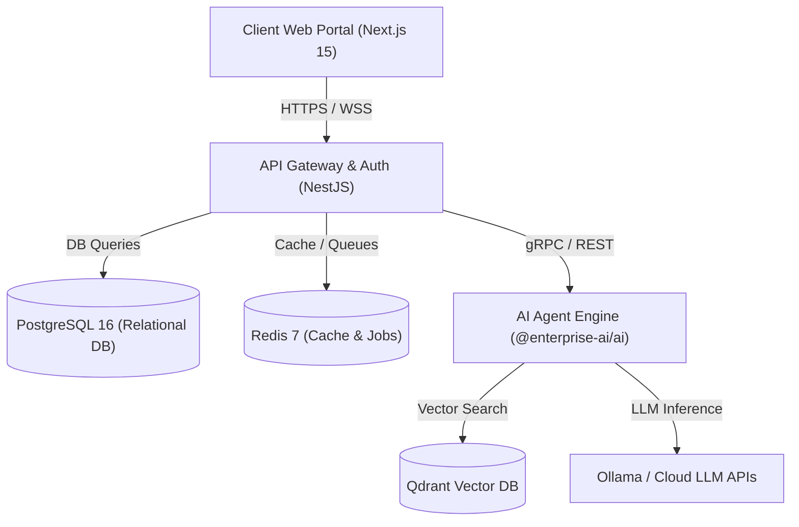
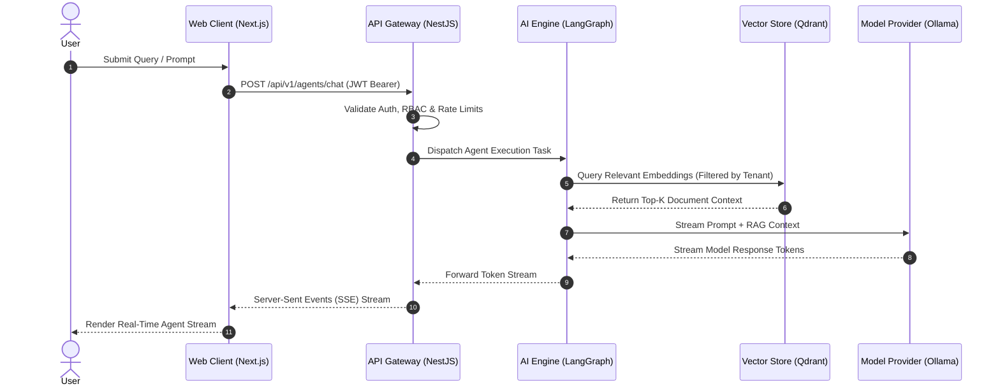

# 01 - System Overview

## Purpose

The Enterprise AI Platform is a production-grade, multi-tenant, cloud-native system designed to orchestrate generative AI workloads, intelligent agents, Retrieval-Augmented Generation (RAG) pipelines, and enterprise data integrations with strict security and observability guardrails.

---

## Architecture

The system follows a modular monorepo architecture divided into distinct service planes:

### Key Subsystems:
1. **Presentation Plane (`apps/web`)**: Next.js 15 React application for agent administration, document upload dashboards, and real-time streaming chat.
2. **API Gateway Plane (`apps/api`)**: NestJS backend managing authentication, RBAC, rate limiting, and request routing.
3. **AI Engine Plane (`packages/ai`)**: LangGraph & LangChain stateful graph orchestrator managing agent reasoning loops and tool execution.
4. **Data Persistence Plane**: Polyglot persistence with PostgreSQL 16 (metadata/audit), Redis 7 (caching/queues), and Qdrant (vector embeddings).

---

## Responsibilities

- **Enterprise Governance**: Enforces tenant-level data isolation, role-based access controls, and prompt security guardrails.
- **Agent Orchestration**: Executes multi-step, stateful reasoning workflows with human-in-the-loop validation checkpoints.
- **Low-Latency RAG**: Performs dense and hybrid vector retrieval against Qdrant vector indices.
- **Local & Hybrid LLM Execution**: Supports local air-gapped inference via Ollama alongside commercial LLM APIs.

---

## Dependencies

- **Frameworks**: Next.js 15, React 19, NestJS, LangGraph, LangChain, Tailwind CSS.
- **Databases**: PostgreSQL 16, Qdrant Vector Store v1.11, Redis 7.
- **Inference Runtime**: Ollama, OpenAI / Anthropic APIs.

---

## Sequence Flow

---

## Best Practices

- **Zero Trust Security**: Every service boundary validates incoming tokens and tenant metadata context.
- **Strict Decoupling**: Application layers communicate through defined interfaces (`@enterprise-ai/types`).
- **Resilience**: Circuit breakers and exponential backoff retry mechanisms wrap all external LLM and database calls.

---

## Future Extensions

- **Multi-Region Replication**: Active-active PostgreSQL and Qdrant cluster replication across global cloud regions.
- **Edge LLM Inference**: WebAssembly / ONNX runtime integration for client-side privacy-first execution.
