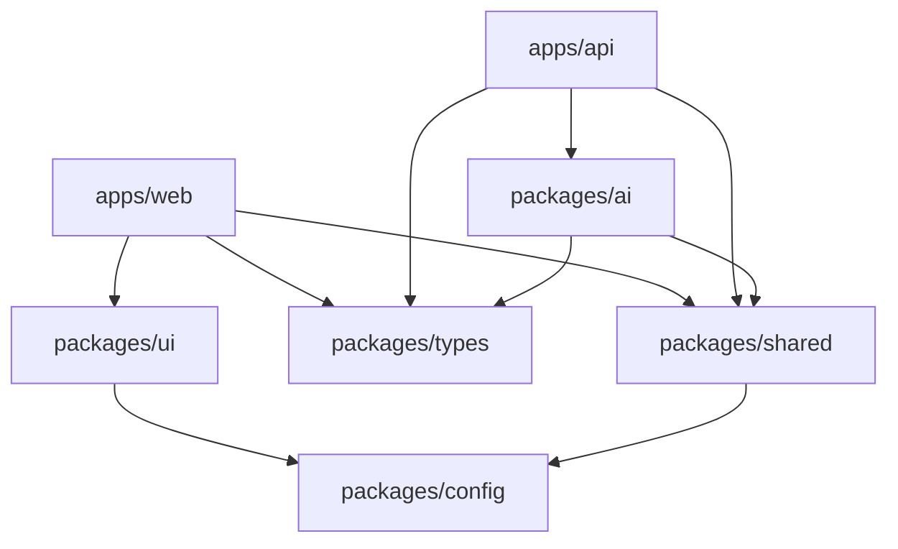
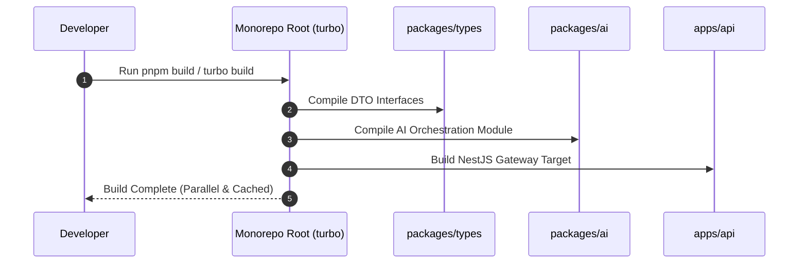

# 02 - Folder Structure Blueprint

## Purpose

This document details the monorepo directory layout, workspace organization, package boundary definitions, and file conventions for the Enterprise AI Platform.

---

## Architecture

The codebase utilizes a `pnpm` workspaces and `Turborepo` monorepo design:

```text
enterprise-ai-platform/
├── .github/                  # CI/CD Workflows, issue templates, PR templates
├── apps/                     # Application deployments
│   ├── api/                  # NestJS API Gateway Core
│   └── web/                  # Next.js 15 Web Portal UI
├── docs/                     # Platform architectural blueprints and ADRs
│   ├── api/                  # API contracts and specifications
│   ├── architecture/         # System design ADRs
│   ├── blueprint/            # Master Architectural Blueprint (18 Specs)
│   ├── decisions/            # Decision record logs
│   └── setup/                # Environment onboarding guides
├── infrastructure/           # Infrastructure as Code
│   ├── docker/               # Docker Compose development manifests
│   └── k8s/                  # Helm charts and production Kubernetes manifests
└── packages/                 # Shared internal libraries
    ├── ai/                   # LangGraph agent engine & RAG pipelines
    ├── config/               # Shared ESLint, Prettier, TSConfig presets
    ├── shared/               # Shared utilities, loggers, validation helpers
    ├── types/                # Shared TypeScript DTOs & domain models
    └── ui/                   # Shared React UI component library
```

---

## Responsibilities

- **`apps/web`**: Provides client-side React 19 pages, Server Components, and streaming UI components.
- **`apps/api`**: Encapsulates NestJS modules for Auth, Users, Tenants, Agents, Knowledge Base, and Telemetry.
- **`packages/ai`**: Houses LangGraph state graph graphs, custom tools, vector database abstractions, and prompt templates.
- **`packages/types`**: Serves as the single source of truth for DTOs and domain interfaces.
- **`packages/ui`**: Contains reusable enterprise design system components.

---

## Dependencies



---

## Sequence Flow



---

## Best Practices

- **Strict Package Barriers**: Internal packages must not import from parent application scopes (`apps/`).
- **Explicit Exports**: Packages expose public APIs via defined `exports` fields in `package.json`.
- **Shared Configuration**: Centralized ESLint and TypeScript rules inherited from `@enterprise-ai/config`.

---

## Future Extensions

- **`packages/database`**: Dedicated Prisma ORM migration package for multi-application database access.
- **`services/ingestion-service`**: Standalone microservice for asynchronous large-scale document parsing.
