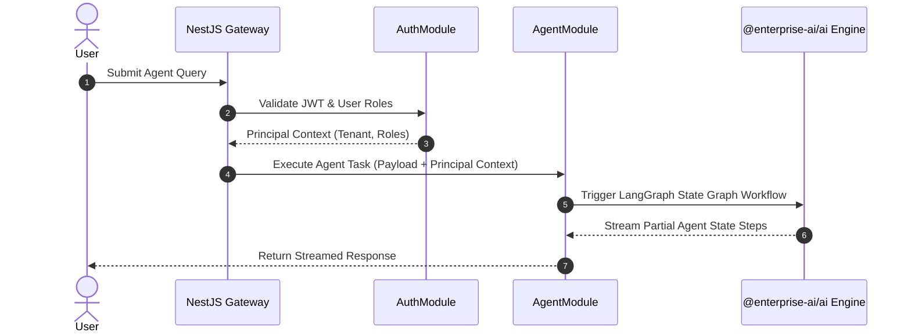

# 03 - Module Responsibilities Blueprint

## Purpose

This document outlines the domain modules, boundary limits, and functional responsibilities across the Enterprise AI Platform's core application layers.

---

## Architecture

The system is decomposed into discrete feature modules following Clean Architecture principles:

```text
+-----------------------------------------------------------------------------------+
|                                 Feature Modules                                   |
+-------------------+--------------------+--------------------+---------------------+
| Auth Module       | Agent Module       | Knowledge Module   | Telemetry Module    |
| (JWT/OAuth2/RBAC) | (LangGraph Graph)  | (Qdrant & Embed)   | (Metrics & Audit)   |
+-------------------+--------------------+--------------------+---------------------+
                                          |
                                          v
+-----------------------------------------------------------------------------------+
|                                Shared Support Layers                              |
|   @enterprise-ai/types    |    @enterprise-ai/shared    |    @enterprise-ai/ui    |
+-----------------------------------------------------------------------------------+
```

---

## Responsibilities

### 1. Auth & Identity Module (`AuthModule`)

- Handles user registration, login, JWT token issuance, and password hashing.
- Enforces Role-Based Access Control (RBAC) and tenant context extraction (`tenantId`).

### 2. Agent Management Module (`AgentModule`)

- Manages agent CRUD operations, prompt templates, tool registrations, and agent execution parameters.
- Dispatches agent run requests to the `@enterprise-ai/ai` engine.

### 3. RAG & Knowledge Base Module (`KnowledgeModule`)

- Handles document ingestion (PDF, DOCX, TXT), text chunking strategies, embedding generation, and vector indexing in Qdrant.
- Performs hybrid semantic search against Qdrant collections.

### 4. System Telemetry & Audit Module (`AuditModule`)

- Logs immutable security audit events (logins, role changes, data exports).
- Tracks LLM token usage metrics, latency, and estimated costs per tenant.

---

## Dependencies

- **`AuthModule`**: Depends on PostgreSQL (`PrismaService`) and Redis (`SessionService`).
- **`AgentModule`**: Depends on `@enterprise-ai/ai`, `AuthModule`, and `KnowledgeModule`.
- **`KnowledgeModule`**: Depends on Qdrant Client, OpenAI/Ollama Embeddings API.

---

## Sequence Flow



---

## Best Practices

- **Feature Encapsulation**: Each module manages its own DTOs, Controllers, Services, and Test suites.
- **Inter-Module Communication**: Modules interact exclusively through exported public service interfaces, never reaching directly into another module's internal repository primitives.

---

## Future Extensions

- **Billing & Quota Module**: Real-time token usage quota enforcement and tier billing.
- **Workflow Plugin Module**: External webhook trigger integration for agent actions.
