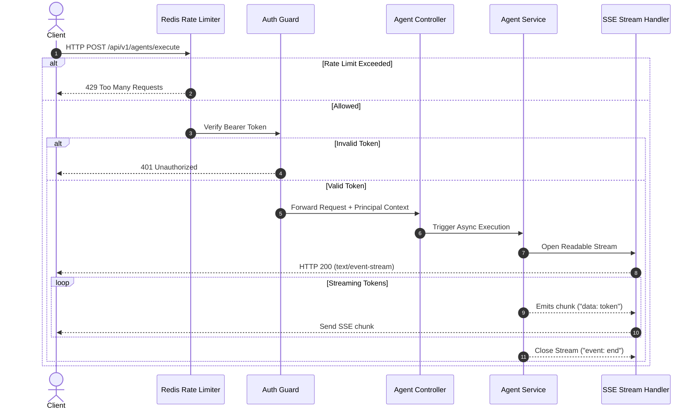

# 04 - Request Flow Blueprint

## Purpose

This document maps the complete end-to-end HTTP, WebSocket, and streaming request lifecycle from client interaction through the API Gateway, processing pipelines, and data stores.

---

## Architecture

Request handling utilizes NestJS middleware pipeline processing:

```text
[Client Request]
       |
       v
[Cors Middleware] -> [Rate Limiter] -> [Auth Guard] -> [RBAC Guard]
       |
       v
[Validation Pipe] -> [Controller Handler] -> [Service UseCase]
       |
       v
[Response Interceptor] -> [JSON Envelope / SSE Stream] -> [Client Response]
```

---

## Responsibilities

- **Request Sanitization**: Intercepts malicious inputs, strips dangerous scripts, and enforces payload length limits.
- **Context Injection**: Attaches validated principal info (`userId`, `tenantId`, `roles`, `correlationId`) to the execution context.
- **Streaming Pipeline**: Manages Server-Sent Events (SSE) for streaming model tokens back to the web portal without buffering.

---

## Dependencies

- NestJS Interceptors & Guards.
- Redis Rate Limiter Store.
- OpenTelemetry Trace Context Propagator.

---

## Sequence Flow



---

## Best Practices

- **Correlation ID Tracking**: Every request receives a `X-Correlation-ID` header injected at the gateway boundary.
- **Fail-Fast Pipe**: Invalid DTO fields rejected at the `ValidationPipe` stage prior to executing database calls.

---

## Future Extensions

- **GraphQL Subscriptions**: Alternative streaming layer alongside SSE and WebSockets.
- **Edge Gateway Filtering**: Pre-filtering malicious traffic using Cloudflare Workers or Nginx/Kong API Gateway.
