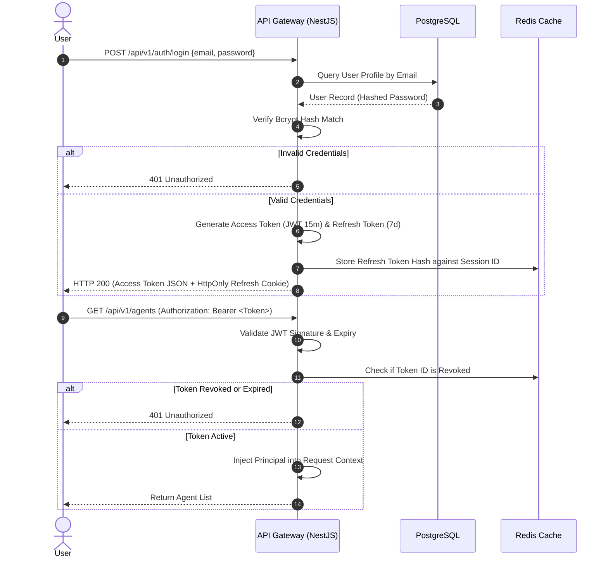

# 05 - Authentication & Authorization Flow Blueprint

## Purpose

This document specifies the identity management, JWT token issue/refresh lifecycle, multi-tenant context propagation, and Role-Based Access Control (RBAC) security flow.

---

## Architecture

Authentication utilizes stateless Json Web Tokens (JWT) backed by Redis token revocation lists:

```text
+-----------------------+           +-----------------------+           +-----------------------+
|  User Login Request   | --------> |  NestJS Auth Guard    | --------> |   Redis Token Store   |
| (email, pass, tenant) |           | (Passport JWT / OAuth)|           | (Revocation / Session)|
+-----------------------+           +-----------------------+           +-----------------------+
                                                |
                                                v
                                    +-----------------------+
                                    | PostgreSQL User Store |
                                    | (Bcrypt Hashed Pass)  |
                                    +-----------------------+
```

---

## Responsibilities

- **Authentication**: Verifies user identity via Bcrypt password comparison or OAuth2 / OIDC SAML enterprise SSO.
- **Token Management**: Issues short-lived Access Tokens (15 min) and long-lived Refresh Tokens (7 days) stored in HttpOnly cookies.
- **Tenant Context Enforcement**: Asserts that every authenticated request contains a valid `tenantId` scope.
- **RBAC Authorization**: Validates required user roles (`SUPER_ADMIN`, `TENANT_ADMIN`, `AGENT_DEVELOPER`, `END_USER`).

---

## Dependencies

- Passport.js & `@nestjs/jwt`.
- Redis Session Cache.
- PostgreSQL Prisma User & Tenant Models.

---

## Sequence Flow



---

## Best Practices

- **HttpOnly Cookies**: Refresh tokens stored exclusively in `HttpOnly`, `Secure`, `SameSite=Strict` cookies.
- **Zero Plaintext Secrets**: Passwords salted and hashed using Bcrypt (cost factor 12).
- **Session Revocation**: Logging out instantly invalidates session IDs in Redis.

---

## Future Extensions

- **SAML 2.0 / Okta Integration**: Enterprise Single Sign-On (SSO) identity federation.
- **Multi-Factor Authentication (MFA)**: Time-based One-Time Password (TOTP) enforcement for administrative actions.
