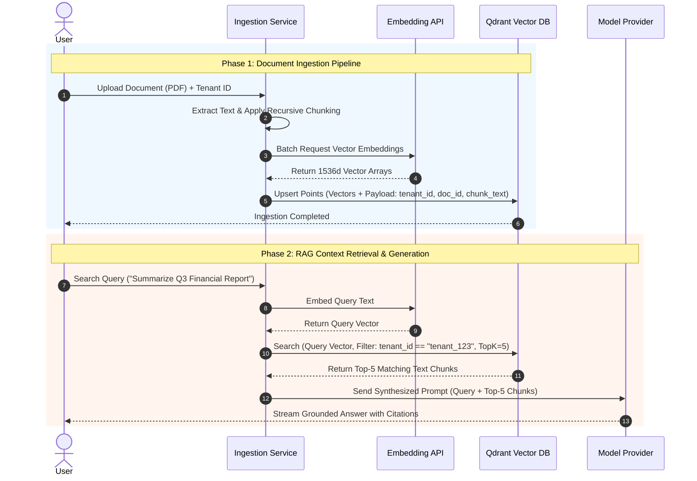

# 06 - RAG Architecture & Pipeline Flow Blueprint

## Purpose

This document details the Retrieval-Augmented Generation (RAG) architecture, document ingestion pipeline, text chunking strategies, vector embedding generation, and Qdrant hybrid vector retrieval flow.

---

## Architecture

The RAG pipeline operates across two main execution phases: **Ingestion** and **Retrieval**.

```text
[Document Ingestion Phase]
Document (PDF/DOCX) -> File Extractor -> Recursive Chunking -> Embeddings API -> Qdrant Vector Store

[Query Retrieval Phase]
User Query -> Embeddings API -> Dense/Sparse Hybrid Query -> Qdrant (Tenant Filter) -> Context Ranker -> LLM Prompt
```

---

## Responsibilities

- **Document Extraction**: Parses raw files (PDFs, Word documents, text, Markdown) into structured text strings.
- **Semantic Chunking**: Splits text using semantic sliding windows (512 tokens with 64-token overlap).
- **Embedding Generation**: Generates 1536-dimensional dense vector embeddings using OpenAI (`text-embedding-3-small`) or Ollama (`nomic-embed-text`).
- **Hybrid Retrieval**: Queries Qdrant using dense vector similarity (Cosine distance) + sparse BM25 keyword matching with tenant payload isolation.

---

## Dependencies

- Qdrant Vector Store (`@qdrant/js-client-rest`).
- LangChain Document Loaders & Text Splitters.
- Embedding Model Provider API (Ollama / OpenAI).

---

## Sequence Flow



---

## Best Practices

- **Metadata Payload Isolation**: All Qdrant points must store `tenant_id` in their payload and filter by `tenant_id` on every query.
- **Context Reranking**: Re-ranks top-K retrieved chunks using a cross-encoder model prior to injecting into the LLM context window.

---

## Future Extensions

- **Parent-Child Chunking**: Store small chunks for vector retrieval linked to larger parent documents for LLM context generation.
- **GraphRAG**: Knowledge graph extraction using Neo4j integrated alongside vector search.
