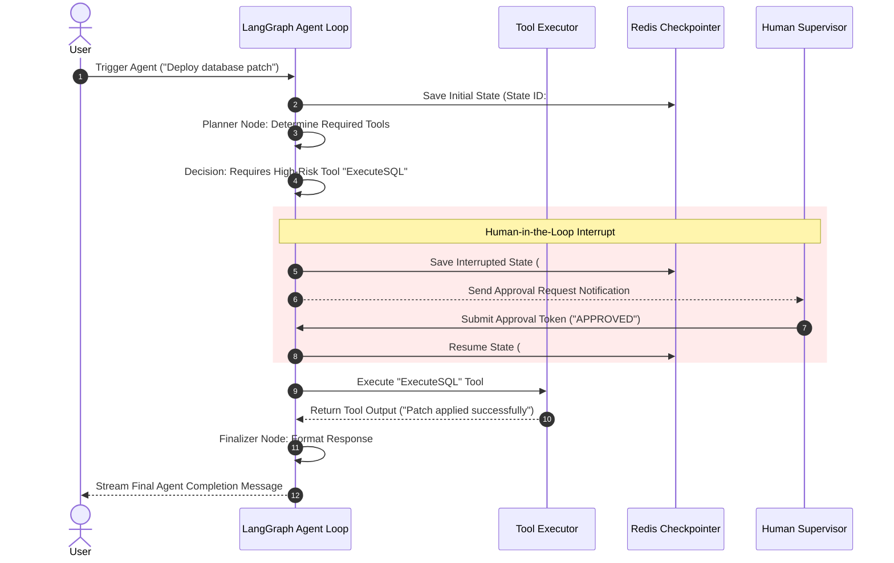

# 07 - AI Agent Execution Flow Blueprint

## Purpose

This document outlines the stateful agent execution loop, state graph definitions, tool invocation pipelines, and human-in-the-loop validation checkpoints implemented in `@enterprise-ai/ai` using **LangGraph**.

---

## Architecture

Agents operate as stateful cyclic graphs using LangGraph state graph runtimes:

```text
[Input State] -> (Agent Planner Node) ----> [Decision Edge: Call Tool?]
                       ^                            |
                       |                     +------+------+
                       |                     |             |
                 (Tool Results)        Yes (Tool Node)   No (End Node)
```

---

## Responsibilities

- **State Graph Management**: Tracks message history, agent scratchpads, tool execution outputs, and execution step counters.
- **Tool Execution Registry**: Exposes typed tools (RAG Vector Search, Web Search, Database Query, Code Execution).
- **Human-in-the-Loop Interrupts**: Pauses agent graph execution when high-risk operations (e.g. database updates, financial transactions) are requested, waiting for manual human approval.

---

## Dependencies

- LangGraph (`@langchain/langgraph`).
- LangChain Core (`@langchain/core`).
- Redis State Checkpointer (State Persistence).

---

## Sequence Flow



---

## Best Practices

- **Bounded Execution Loops**: Set max recursion limits (e.g., `max_iterations = 15`) to prevent infinite tool-calling loops.
- **Schema Validation**: All tool input arguments validated against Zod schemas before execution.

---

## Future Extensions

- **Multi-Agent Teams**: Hierarchical supervisor agents orchestrating specialized worker agents (e.g. Coder Agent, QA Agent, Planner Agent).
- **Time-Travel Debugging**: Replay and resume agent state graphs from any past checkpoint line in the UI dashboard.
