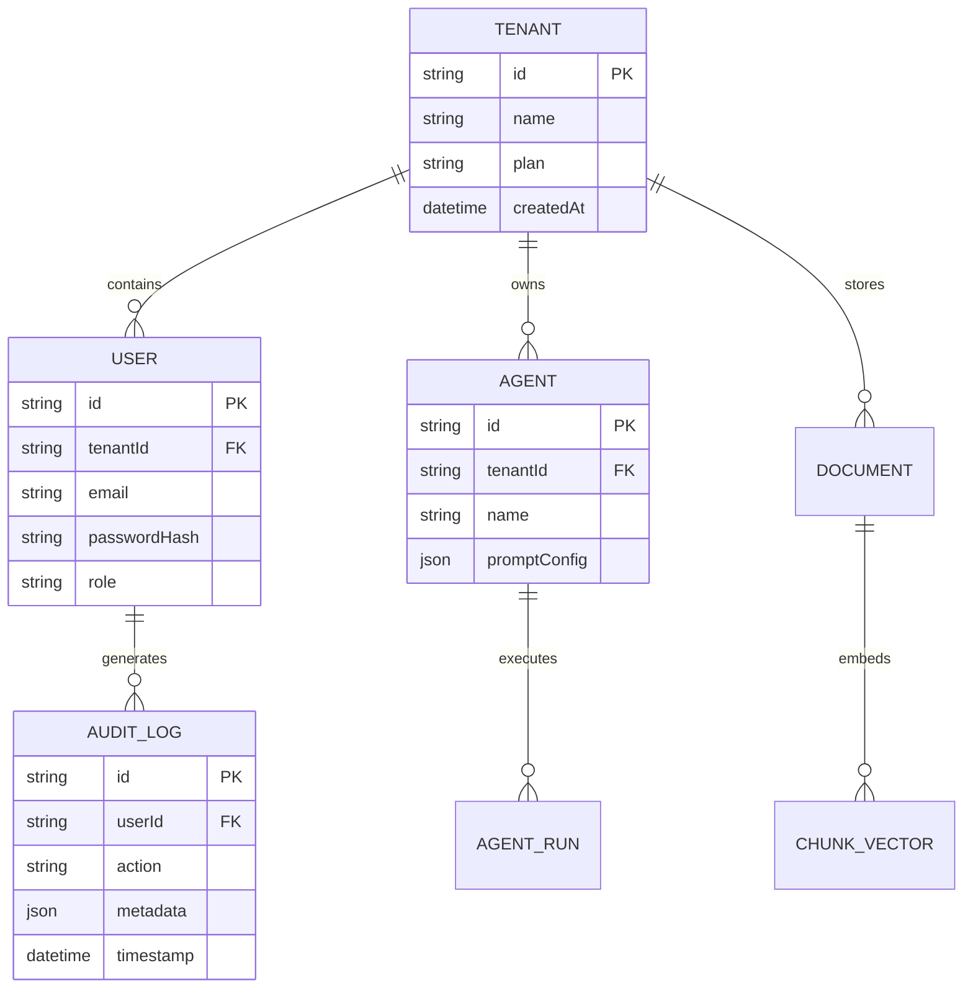

# 08 - Database Architecture Blueprint

## Purpose

This document details the database schemas, relational entity relationships, vector store payload configurations, and multi-tenant data isolation rules.

---

## Architecture

The persistence architecture combines relational, vector, and key-value storage:

```text
+------------------------------------+      +------------------------------------+
|  PostgreSQL 16 (Relational Engine) |      |   Qdrant Vector Database           |
|  - Users & Roles                   |      |   - Embeddings Collection          |
|  - Tenants & Subscriptions         |      |   - Document Chunk Metadata        |
|  - Agent Configs & Runs            |      |   - Payload Index (tenant_id)      |
|  - Immutable Audit Logs            |      +------------------------------------+
+------------------------------------+      +------------------------------------+
                  |                                           |
                  +---------------------+---------------------+
                                        |
                                        v
                    +----------------------------------------+
                    |  Redis 7 (In-Memory Key-Value Engine)  |
                    |  - JWT Session Cache                   |
                    |  - Rate Limiting Counters              |
                    |  - BullMQ Queue State                  |
                    +----------------------------------------+
```

---

## Responsibilities

- **PostgreSQL**: Manages core business records with relational constraints, foreign keys, and transaction guarantees.
- **Qdrant**: Manages high-dimensional vector embeddings, HNSW graph indices, and cosine similarity search.
- **Redis**: Handles microsecond caching, transient session states, rate limiting, and background job queues.

---

## Dependencies

- Prisma ORM / TypeORM.
- Qdrant REST Client.
- ioredis Client.

---

## Sequence Flow



---

## Best Practices

- **Migration Governance**: All PostgreSQL schema alterations applied via declarative ORM migration files committed in git.
- **Payload Indexing**: Qdrant payload field `tenant_id` MUST be indexed as a keyword field for fast filtered vector retrieval.

---

## Future Extensions

- **Database Sharding**: Partitioning PostgreSQL databases across tenant clusters for enterprise tier customers.
- **Automated Point-in-Time Recovery (PITR)**: Automated continuous WAL archiving for zero data loss.
