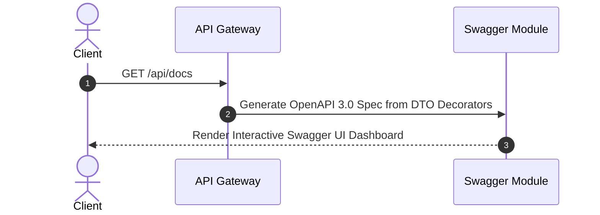

# 09 - API Design Blueprint

## Purpose

This document defines the RESTful endpoints, API versioning strategy, standardized request/response envelopes, streaming SSE formats, and OpenAPI/Swagger documentation rules.

---

## Architecture

APIs follow RESTful URI conventions versioned at `/api/v1/`:

```text
/api/v1/auth/login                  -> User Authentication
/api/v1/users                       -> User Management
/api/v1/tenants                     -> Tenant Administration
/api/v1/agents                      -> Agent CRUD & Execution
/api/v1/rag/ingest                  -> Knowledge Ingestion
/api/v1/telemetry                   -> Audit Logs & Token Analytics
```

---

## Responsibilities

- **Uniform Response Envelopes**: Standardized JSON responses for all REST routes.
- **OpenAPI Schema Generation**: Automated Swagger documentation exposed at `/api/docs`.
- **Streaming Endpoints**: Server-Sent Events (`text/event-stream`) for streaming LLM tokens.

---

## Dependencies

- `@nestjs/swagger`.
- Class-Validator & Zod.

---

## Standard Response Envelopes

### Success Envelope
```json
{
  "success": true,
  "data": {
    "agentId": "agent_123",
    "name": "Financial Analyst Agent",
    "status": "active"
  },
  "error": null,
  "timestamp": "2026-07-22T12:00:00.000Z"
}
```

### Error Envelope
```json
{
  "success": false,
  "data": null,
  "error": {
    "code": "RESOURCE_NOT_FOUND",
    "message": "Agent with ID agent_999 was not found.",
    "details": [],
    "traceId": "trace_abc123"
  },
  "timestamp": "2026-07-22T12:00:00.000Z"
}
```

---

## Sequence Flow



---

## Best Practices

- **Explicit HTTP Verbs**: Use `GET` for reads, `POST` for creations, `PUT`/`PATCH` for updates, and `DELETE` for removals.
- **Strict DTO Validation**: All request bodies validated against DTO classes decorated with `@IsString()`, `@IsEmail()`, etc.

---

## Future Extensions

- **GraphQL API Gateway**: Alternative GraphQL interface for complex nested queries.
- **gRPC External Interfaces**: gRPC proto definitions for high-throughput enterprise B2B integrations.
