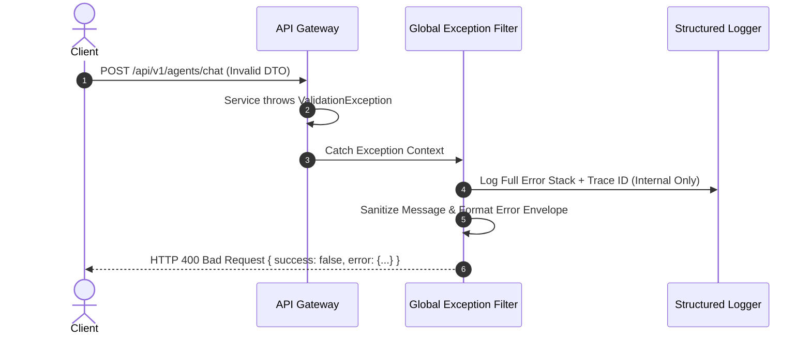

# 10 - Error Handling Architecture Blueprint

## Purpose

This document specifies exception handling hierarchies, global exception filters, error mapping, and sanitization guidelines to ensure resilience and security.

---

## Architecture

Exception handling utilizes a global NestJS `ExceptionFilter` pipeline:

```text
[Unhandled Exception] -> [Global Exception Filter] -> [Sanitizer Filter] -> [JSON Error Envelope]
```

---

## Responsibilities

- **Exception Normalization**: Catches HTTP, RPC, and uncaught exceptions and transforms them into standardized JSON error envelopes.
- **Security Sanitization**: Strips internal stack traces and raw SQL error strings from client responses in production mode.
- **Telemetry Correlation**: Attaches the request's `traceId` to the error envelope for cross-system log correlation.

---

## Dependencies

- `@nestjs/common` (`ExceptionFilter`, `Catch`).
- Pino Logger / OpenTelemetry SDK.

---

## Error Classification Table

| Error Class | Status Code | Error Code | Description |
| :--- | :--- | :--- | :--- |
| `BadRequestException` | 400 | `INVALID_PAYLOAD` | Request body failed DTO validation rules |
| `UnauthorizedException` | 401 | `UNAUTHORIZED` | Invalid or missing authentication credentials |
| `ForbiddenException` | 403 | `FORBIDDEN` | Principal lacks required RBAC role |
| `NotFoundException` | 404 | `NOT_FOUND` | Requested entity does not exist |
| `PromptInjectionException` | 422 | `PROMPT_INJECTION_DETECTED` | Input text triggered prompt safety guardrails |
| `VectorStoreException` | 503 | `VECTOR_DB_UNAVAILABLE` | Qdrant vector database query timeout or failure |
| `InternalServerErrorException` | 500 | `INTERNAL_SERVER_ERROR` | Unhandled system exception |

---

## Sequence Flow



---

## Best Practices

- **Never Swallowing Errors**: Catch blocks must log errors or rethrow typed domain exceptions.
- **Sanitized Messages**: Public error messages must explain *what went wrong* without exposing *how the system is implemented*.

---

## Future Extensions

- **Automated Sentry Integration**: Real-time exception reporting to Sentry for uncaught production bugs.
- **Self-Healing Fallbacks**: Automatic fallback to local LLM when cloud API providers return 5xx errors.
