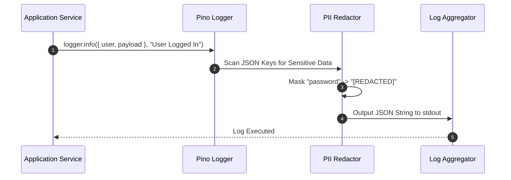

# 11 - Logging Architecture Blueprint

## Purpose

This document defines the structured logging format, log level criteria, correlation ID injection, and PII masking rules across all microservices and packages.

---

## Architecture

Logging utilizes a high-performance structured JSON logger (Pino) integrated with OpenTelemetry:

```text
[App Code] -> [Pino JSON Logger] -> [Stdout / Stream] -> [OpenTelemetry Collector] -> [Grafana Loki]
```

---

## Responsibilities

- **Structured Output**: Emits machine-readable single-line JSON logs to `stdout`.
- **Context Injection**: Enriches every log entry with `timestamp`, `level`, `service`, `traceId`, `spanId`, `tenantId`, and `userId`.
- **Redaction & Masking**: Automatically redacts sensitive fields (`password`, `jwt`, `apiKey`, `creditCard`) prior to serialization.

---

## Dependencies

- `pino` & `nestjs-pino`.
- `@opentelemetry/api`.

---

## Log Schema Sample

```json
{
  "level": 30,
  "time": "2026-07-22T12:00:00.000Z",
  "pid": 4821,
  "hostname": "api-gateway-pod-7f",
  "service": "api-gateway",
  "traceId": "4bf92f3577b34da6a3ce929d0e0e4736",
  "spanId": "00f067aa0ba902b7",
  "tenantId": "tenant_enterprise_01",
  "userId": "user_882",
  "msg": "Agent graph execution completed successfully",
  "durationMs": 412,
  "tokenCount": 850
}
```

---

## Sequence Flow



---

## Best Practices

- **Zero Unstructured Logs**: Avoid `console.log()` string concatenation. Always use structured key-value objects.
- **Log Levels**:
  - `DEBUG`: Local development insights.
  - `INFO`: Significant state changes (User Login, Document Indexing Completed).
  - `WARN`: Degradation or retry attempts.
  - `ERROR`: System failures requiring intervention.

---

## Future Extensions

- **Log Sampling Optimization**: Dynamic log sampling to reduce storage costs for high-volume debug logs in production.
