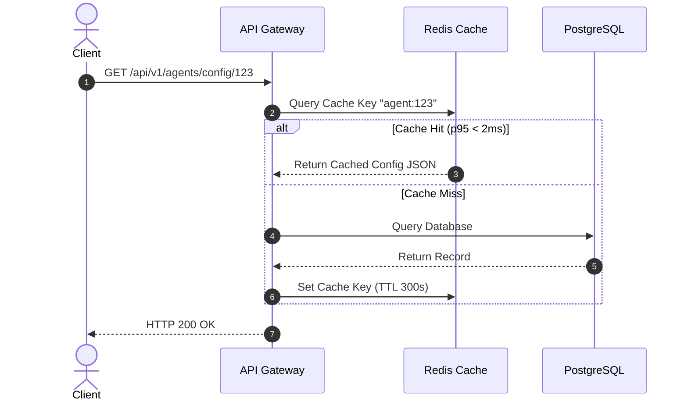

# 13 - Performance Optimization Blueprint

## Purpose

This document specifies performance SLAs, database query indexing, memory management, response streaming, and bundle size minimization techniques.

---

## Architecture

Performance optimization targets all layers of the stack:

```text
[Next.js Server Components (Zero JS)] -> [Redis API Caching] -> [Qdrant HNSW Vector Index] -> [Ollama Local GPU Acceleration]
```

---

## Responsibilities

- **Response Streaming**: Eliminates buffer delays by streaming LLM output tokens directly to clients.
- **Vector Index Tuning**: Configures Qdrant HNSW graph parameters (`m=16`, `ef_construct=100`) for low search latencies (<50ms).
- **Database Connection Pooling**: Manages database connections using Prisma / PgBouncer connection pooling.

---

## Dependencies

- Redis Connection Cache.
- Qdrant Vector Indexing Engine.

---

## Performance SLA Targets

| Operation                  | Target Latency (p95) | Target Throughput      |
| :------------------------- | :------------------- | :--------------------- |
| API Gateway Authentication | `< 15 ms`            | 5,000 req/sec          |
| Qdrant Vector Search       | `< 45 ms`            | 1,200 req/sec          |
| First Token Latency (TTFT) | `< 400 ms`           | 100 concurrent streams |
| Database Metadata Read     | `< 10 ms`            | 10,000 req/sec         |

---

## Sequence Flow



---

## Best Practices

- **Zero Blocking Event Loop**: Never perform heavy synchronous operations on the main Node.js event loop.
- **Index Guarding**: All queried PostgreSQL foreign keys and filter fields must be indexed.

---

## Future Extensions

- **Edge Deployment**: Deploying Next.js frontend and static assets to Cloudflare Global CDN edge nodes.
- **Semantic Caching**: Caching previous LLM answers based on query vector similarity (>0.95 similarity score).
