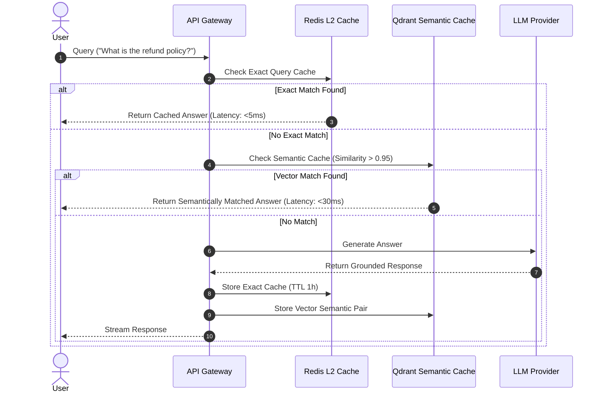

# 14 - Caching Architecture Blueprint

## Purpose

This document outlines the multi-level caching hierarchy, cache invalidation strategies, TTL configurations, and Redis distributed caching architecture.

---

## Architecture

The caching framework operates across three distinct levels:

```text
Level 1: In-Memory L1 Cache (Node-Cache / LRU in process memory)
Level 2: Distributed L2 Cache (Redis 7)
Level 3: Semantic LLM Cache (Vector Match in Qdrant)
```

---

## Responsibilities

- **L1 In-Memory Caching**: Caches static configuration constants for microsecond retrieval.
- **L2 Redis Caching**: Caches API response payloads, user RBAC permissions, and active session tokens.
- **Semantic Caching**: Prevents duplicate LLM API spend by matching incoming queries against previously answered queries using vector embedding similarity.

---

## Dependencies

- Redis (`ioredis`).
- Qdrant Vector Cache Collection.

---

## Cache Invalidation Matrix

| Cache Domain          | Key Pattern                  | TTL      | Invalidation Strategy                      |
| :-------------------- | :--------------------------- | :------- | :----------------------------------------- |
| User Session          | `session:{userId}`           | 15 min   | Explicit on logout or password change      |
| Agent Config          | `agent:{tenantId}:{agentId}` | 1 hour   | Event-driven on agent update               |
| Tenant Settings       | `tenant:{tenantId}`          | 24 hours | Event-driven on tenant subscription change |
| Semantic Prompt Cache | `semantic:{vectorHash}`      | 7 days   | LRU eviction policy                        |

---

## Sequence Flow



---

## Best Practices

- **Cache Stampede Prevention**: Use mutex locking / probabilistic early expiration (XFetch) to prevent simultaneous DB queries when keys expire.
- **Key Namespacing**: Always prefix keys with clear domain namespaces (`enterprise:tenant_123:session:user_456`).

---

## Future Extensions

- **Distributed Redis Sentinel / Cluster**: Multi-region failover cluster for high-availability enterprise scale.
