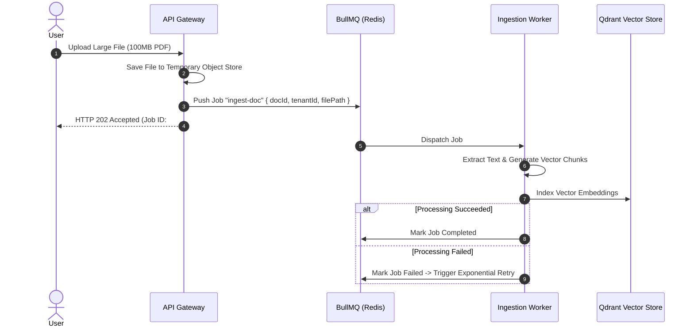

# 15 - Background Jobs Architecture Blueprint

## Purpose

This document specifies asynchronous background job processing, queue management, worker concurrency, and failure retry strategies using **BullMQ** and **Redis**.

---

## Architecture

Background processing uses dedicated queue workers separated from the API Gateway:

```text
[API Gateway] ---> (Enqueues Job) ---> [Redis / BullMQ Queue]
                                                |
                                                v
                                  [Dedicated Worker Process]
                                 (Ingestion, Retries, Audit)
```

---

## Responsibilities

- **Document Processing Queue (`ingestion-queue`)**: Asynchronous PDF parsing, chunking, and vector embedding generation.
- **Audit Event Queue (`audit-queue`)**: Asynchronous batch writing of security audit logs to PostgreSQL.
- **Scheduled Maintenance Jobs (`cron-queue`)**: Periodic cleanup of expired tokens, temp files, and vector index compaction.

---

## Dependencies

- BullMQ (`bullmq`).
- Redis 7.

---

## Queue Configuration Parameters

| Queue Name           | Concurrency | Max Retries | Backoff Strategy       | Job Timeout |
| :------------------- | :---------- | :---------- | :--------------------- | :---------- |
| `document-ingestion` | 5 workers   | 3 retries   | Exponential (10s base) | 15 minutes  |
| `audit-logging`      | 10 workers  | 5 retries   | Fixed (2s base)        | 30 seconds  |
| `scheduled-tasks`    | 1 worker    | 2 retries   | Exponential (60s base) | 1 hour      |

---

## Sequence Flow



---

## Best Practices

- **Idempotent Workers**: Job handlers must be idempotent so reprocessing a retried job produces identical results without duplication.
- **Dead Letter Queues (DLQ)**: Jobs failing after maximum retry attempts move to a Dead Letter Queue for developer inspection.

---

## Future Extensions

- **Distributed Task Scaling**: Kubernetes Horizontal Pod Autoscaling (HPA) driven by BullMQ queue depth metrics.
