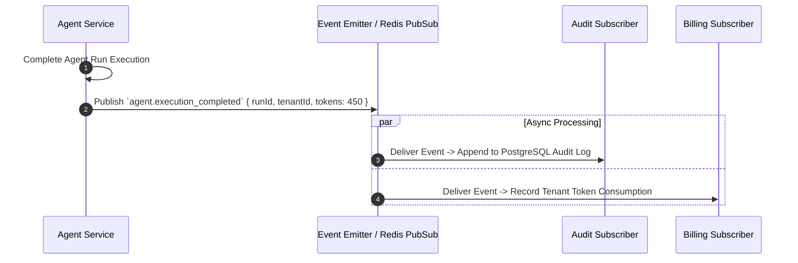

# 16 - Event-Driven Architecture Blueprint

## Purpose

This document maps the internal domain events, event emitter pipelines, pub/sub messaging mechanisms, and system state synchronization.

---

## Architecture

Event messaging utilizes an in-memory Event Emitter for intra-process events and Redis Pub/Sub for inter-process communication:

```text
[Domain Service] ---> (Emits Event) ---> [NestJS EventEmitter2 / Redis PubSub]
                                                    |
                                    +---------------+---------------+
                                    |                               |
                           [Audit Subscriber]             [Telemetry Subscriber]
```

---

## Responsibilities

- **Domain Event Emission**: Triggers decoupled side-effects when business entities state change (e.g. `UserCreatedEvent`, `AgentExecutedEvent`, `DocumentIngestedEvent`).
- **Decoupled Subscribers**: Allows audit, telemetry, and notification services to listen to events without coupling core domain services.

---

## Dependencies

- `@nestjs/event-emitter`.
- Redis Pub/Sub (`ioredis`).

---

## Core Domain Events Table

| Event Name | Publisher | Payload Data | Subscribers |
| :--- | :--- | :--- | :--- |
| `user.logged_in` | `AuthModule` | `userId`, `tenantId`, `ipAddress` | `AuditModule`, `SecurityAlertService` |
| `agent.execution_started` | `AgentModule` | `agentId`, `runId`, `tenantId` | `TelemetryService` |
| `agent.execution_completed` | `AgentModule` | `agentId`, `runId`, `tokenUsage` | `BillingService`, `AuditModule` |
| `document.indexed` | `KnowledgeModule` | `docId`, `tenantId`, `vectorCount` | `NotificationService` |

---

## Sequence Flow



---

## Best Practices

- **Non-Blocking Handlers**: Event listeners execute asynchronously and must not block the emitting request thread.
- **Event Schemas**: Event payloads defined as strict TypeScript classes in `@enterprise-ai/types`.

---

## Future Extensions

- **Apache Kafka / RabbitMQ Integration**: Migration to Kafka for high-throughput enterprise event streams and event sourcing.
