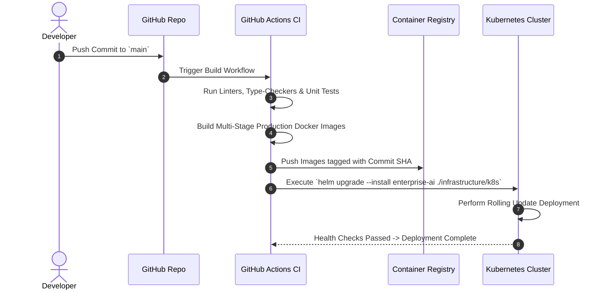

# 17 - Deployment Architecture Blueprint

## Purpose

This document details container build pipelines, Kubernetes manifests, Helm chart configurations, environment provisioning, and CI/CD automated deployment workflows.

---

## Architecture

Deployments follow a GitOps containerized deployment pipeline:

```text
[Git Push to main] -> [GitHub Actions CI] -> [Build OCI Docker Images] -> [Push to Registry] -> [Kubernetes Helm Deploy]
```

---

## Responsibilities

- **Containerization**: Multi-stage production `Dockerfile` manifests for `@enterprise-ai/web` and `@enterprise-ai/api`.
- **Orchestration**: Kubernetes manifests defining Deployments, StatefulSets, Services, Ingress, and ConfigMaps.
- **Air-Gapped Provisioning**: Package bundle scripts enabling installation in enterprise environments without external internet connectivity.

---

## Dependencies

- Docker & Docker Compose.
- Kubernetes & Helm 3.
- GitHub Actions CI/CD.

---

## Kubernetes Component Manifest Map

```text
infrastructure/k8s/
├── templates/
│   ├── api-deployment.yaml          # NestJS Gateway Pods (HPA: 2 - 10 replicas)
│   ├── web-deployment.yaml          # Next.js Web UI Pods (HPA: 2 - 5 replicas)
│   ├── postgres-statefulset.yaml    # PostgreSQL Primary Database Pod
│   ├── qdrant-statefulset.yaml      # Qdrant Vector DB StatefulSet
│   ├── redis-deployment.yaml        # Redis Cache Pod
│   └── ingress.yaml                 # Nginx Ingress Controller & TLS Certs
├── Chart.yaml                       # Helm Chart Metadata
└── values.yaml                      # Production Deployment Configuration
```

---

## Sequence Flow



---

## Best Practices

- **Non-Root Containers**: Docker containers run under unprivileged non-root users (`node` / `appuser`).
- **Health Probes**: Liveness (`/readyz`) and Readiness (`/health`) probes configured on every deployment.

---

## Future Extensions

- **ArgoCD GitOps**: Automated continuous deployment synchronization directly from the Git repository state.
