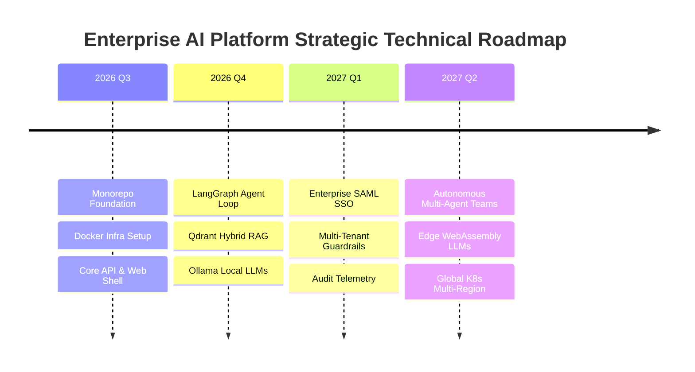

# 18 - Future Technical Roadmap Blueprint

## Purpose

This document outlines the multi-year technical roadmap, architectural evolution milestones, research initiatives, and planned scale enhancements for the Enterprise AI Platform.

---

## Architecture Evolution

```text
[Phase 1 & 2: Monorepo Foundation & Core Platform]
                       |
                       v
[Phase 3: Stateful LangGraph AI Engine & Qdrant RAG Pipeline]
                       |
                       v
[Phase 4: Multi-Tenant Enterprise Security & Fine-Tuning]
                       |
                       v
[Phase 5: Global Distributed Scale, Edge Inference & Auto-Agents]
```

---

## Technical Milestones & Roadmap Phases

### Phase 1 & 2: Repository Foundation & Core Platform (Q3 2026)

- Monorepo workspace initialization, Turborepo pipelines, Docker development environment.
- NestJS API Gateway core, Next.js 15 Web Portal shell, PostgreSQL schema migrations.

### Phase 3: AI Orchestrator & Advanced RAG (Q4 2026)

- LangGraph stateful agent execution loop integration in `@enterprise-ai/ai`.
- Qdrant hybrid vector search (dense + BM25 sparse) with reranking models.
- Local privacy-first model execution support via Ollama runtime.

### Phase 4: Enterprise Governance & Fine-Tuning (Q1 2027)

- Multi-tenant data isolation enforcement in PostgreSQL and Qdrant.
- Real-time prompt injection defenses and automated PII redaction filters.
- Enterprise SSO (SAML 2.0 / Okta) and granular RBAC permission matrix.

### Phase 5: Autonomous Multi-Agent Systems & Global Scale (Q2 2027)

- Multi-agent supervisor team orchestration with dynamic sub-task delegators.
- Edge model inference execution using ONNX and WebAssembly runtimes.
- Kubernetes multi-region active-active database replication.

---

## Dependencies

- Next.js 15, NestJS, LangGraph, Qdrant, PostgreSQL, Redis, Ollama, Docker, Kubernetes.

---

## Sequence Flow



---

## Best Practices

- **Continuous Refactoring**: Schedule architectural debt evaluation cycles after every major phase release.
- **Backward Compatibility**: Ensure API endpoints maintain backward compatibility through strict versioning (`/api/v1`, `/api/v2`).

---

## Future Extensions

- **Self-Improving Prompt Engineering**: Automated DSPy prompt optimization pipeline tuning agent instructions automatically based on user feedback ratings.
